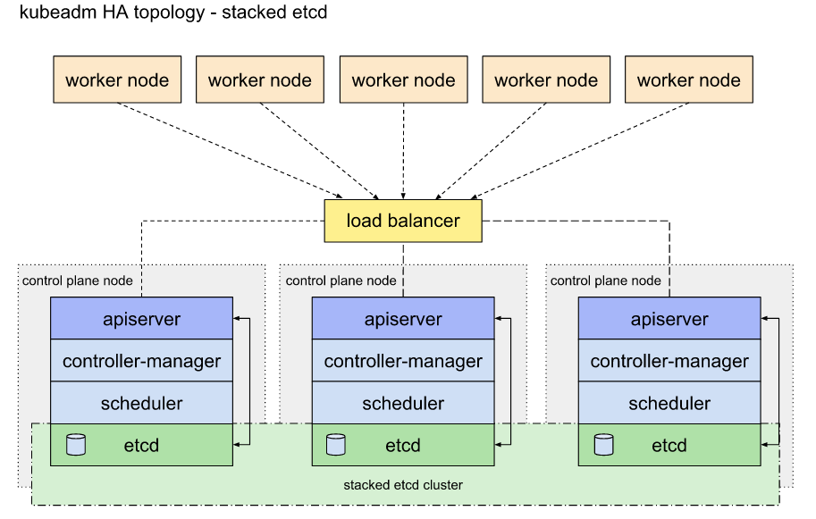

# 💥 Create High Availability Clusters with kubeadm 💥
## [3 master, 1 worker node]

# Topology



### Check Point

**Static pod**

노드 실행과 동시에 생성되는 파드

```
/var/lib/kubelet/config.yml 에 staticPodPath가 정의 되어 있음
staticPodPath= /etc/kubernetes/manifests 에 꼭 실행되어야 할 파드들이 정의 되어 있음
즉, 위 경로에 정의되어 있는 파드들은 노드 실행시 자동으로 실행된다.
```

# HandsOn

### 1. 호스트 & 가상머신사양

- 호스트
    - 운영체제: Ubuntu 18.04
    - Cpu Core: 5
    - Memory: 16GB
    - HyperVisor: Virt-Manager(qemu/kvm)
- 가상머신
    - 운영체제: CentOS 7
    - Cpu Core: 2
    - Memory: 3072MB
    - NIC: Nat Network

### 2.  Requirement

1. Off firewalld

    ```bash
    sudo systemctl stop firewalld
    sudo systemctl disable firewalld
    ```

2. 모듈 설정 - All Node
    - br_netfilter 모듈 로드

        ```
        sudo modprobe br_netfilte
        ```

    - 브릿지 커널 파라미터 수정

        ```
        cat <<EOF | sudo tee /etc/sysctl.d/k8s.conf
        net.bridge.bridge-nf-call-ip6tables = 1
        net.bridge.bridge-nf-call-iptables = 1
        EOF
        ```

        ```
        sudo sysctl --system
        ```

3. 스왑 비활성화 - All Node
    - runtime swap off

    ```
    sudo swapoff -a
    ```

    - (Optional) Modify FileSystem Table

    ```
    vi /etc/fstab
    ...
    #/dev/mapper/centos-swap    swap    swap    defaults    0    0
    ```

4. 컨테이너 런타임(도커) 설치 - All Node

    ```
    sudo yum install -y yum-utils
    ```

    ```
    sudo yum-config-manager \\
        --add-repo \\
        <https://download.docker.com/linux/centos/docker-ce.repo>
    ```

    ```
    sudo yum install -y docker-ce docker-ce-cli containerd.io
    ```

    ```
    sudo systemctl enable --now docker
    ```

    ```
    sudo usermod -aG docker $USER
    ```

5. SELinux PErmissive 모드 전환

    ```
    sudo setenforce 0
    ```

    ```
    sudo sed -i 's/^SELINUX=enforcing$/SELINUX=permissive/' /etc/selinux/config
    ```

### 3. Kubernetes 패키지 설치 - All Node

1. 저장소 연결

    ```
    cat <<EOF | sudo tee /etc/yum.repos.d/kubernetes.repo
    [kubernetes]
    name=Kubernetes
    baseurl=https://packages.cloud.google.com/yum/repos/kubernetes-el7-\\$basearch
    enabled=1
    gpgcheck=1
    repo_gpgcheck=1
    gpgkey=https://packages.cloud.google.com/yum/doc/yum-key.gpg <https://packages.cloud.google.com/yum/doc/rpm-package-key.gpg>
    exclude=kubelet kubeadm kubectl
    EOF
    ```

2. 패키지 설치

    ```
    sudo yum install -y kubelet kubeadm kubectl --disableexcludes=kubernetes
    ```

    ```
    sudo systemctl enable --now kubelet
    ```

### 4. High Availability Considerations

- keepalive: haproxy 파드에 vip 할당해주는 역할
- haproxy: 파드형태로 생성되고 로드밸런서 역할로 마스터노드의 고가용성 구현

**1) keepalive, haproxy 설정 파일 생성**

- keepalived configuration

    path: /etc/keepalived/keepalived.conf

    ```bash
    global_defs {
        router_id LVS_DEVEL
    }
    vrrp_script check_apiserver {
      script "/etc/keepalived/check_apiserver.sh"
      interval 3
      weight -2
      fall 10
      rise 2
    }

    vrrp_instance VI_1 {
        state BACKUP
        interface eth0
        virtual_router_id 51
        priority 100
        authentication {
            auth_type PASS
            auth_pass password
        }
        virtual_ipaddress {
            192.168.122.10 dev eth0
        }
        track_script {
            check_apiserver
        }
    }
    ```

    path: /etc/keepalived/check_apiserver.sh

    ```bash
    #!/bin/sh

    errorExit() {
        echo "*** $*" 1>&2
        exit 1
    }
    export APISERVER_VIP=192.168.122.10
    export APISERVER_DEST_PORT=6443

    curl --silent --max-time 2 --insecure https://localhost:${APISERVER_DEST_PORT}/ -o /dev/null || errorExit "Error GET https://localhost:${APISERVER_DEST_PORT}/"
    if ip addr | grep -q ${APISERVER_VIP}; then
        curl --silent --max-time 2 --insecure https://${APISERVER_VIP}:${APISERVER_DEST_PORT}/ -o /dev/null || errorExit "Error GET https://${APISERVER_VIP}:${APISERVER_DEST_PORT}/"
    fi
    ```

- haproxy configuration

    path: /etc/haproxy/haproxy.cfg

    ```bash
    # /etc/haproxy/haproxy.cfg
    #---------------------------------------------------------------------
    # Global settings
    #---------------------------------------------------------------------
    global
        log /dev/log local0
        log /dev/log local1 notice
        daemon

    #---------------------------------------------------------------------
    # common defaults that all the 'listen' and 'backend' sections will
    # use if not designated in their block
    #---------------------------------------------------------------------
    defaults
        mode                    http
        log                     global
        option                  httplog
        option                  dontlognull
        option http-server-close
        option forwardfor       except 127.0.0.0/8
        option                  redispatch
        retries                 1
        timeout http-request    10s
        timeout queue           20s
        timeout connect         5s
        timeout client          20s
        timeout server          20s
        timeout http-keep-alive 10s
        timeout check           10s

    #---------------------------------------------------------------------
    # apiserver frontend which proxys to the masters
    #---------------------------------------------------------------------
    frontend apiserver
        bind *:8443
        mode tcp
        option tcplog
        default_backend apiserver

    #---------------------------------------------------------------------
    # round robin balancing for apiserver
    #---------------------------------------------------------------------
    backend apiserver
        option httpchk GET /healthz
        http-check expect status 200
        mode tcp
        option ssl-hello-chk
        balance     roundrobin
            server master1 192.168.122.11:8443 check
            server master2 192.168.122.12:8443 check
            server master3 192.168.122.13:8443 check
            # [...]
    ```

**2) keepalive, haproxy static pod 파일 생성(yml)**

For this setup, two manifest files need to be created in /etc/kubernetes/manifests (create the directory first).

- The manifest for keepalived, /etc/kubernetes/manifests/keepalived.yaml:

    ```yaml
    apiVersion: v1
    kind: Pod
    metadata:
      creationTimestamp: null
      name: keepalived
      namespace: kube-system
    spec:
      containers:
      - image: osixia/keepalived:1.3.5-1
        name: keepalived
        resources: {}
        securityContext:
          capabilities:
            add:
            - NET_ADMIN
            - NET_BROADCAST
            - NET_RAW
        volumeMounts:
        - mountPath: /usr/local/etc/keepalived/keepalived.conf
          name: config
        - mountPath: /etc/keepalived/check_apiserver.sh
          name: check
      hostNetwork: true
      volumes:
      - hostPath:
          path: /etc/keepalived/keepalived.conf
        name: config
      - hostPath:
          path: /etc/keepalived/check_apiserver.sh
        name: check
    status: {}
    ```

- The manifest for haproxy, /etc/kubernetes/manifests/haproxy.yaml:

    ```yaml
    apiVersion: v1
    kind: Pod
    metadata:
      name: haproxy
      namespace: kube-system
    spec:
      containers:
      - image: haproxy:2.1.4
        name: haproxy
        livenessProbe:
          failureThreshold: 8
          httpGet:
            host: localhost
            path: /healthz
            port: 8443
            scheme: HTTPS
        volumeMounts:
        - mountPath: /usr/local/etc/haproxy/haproxy.cfg
          name: haproxyconf
          readOnly: true
      hostNetwork: true
      volumes:
      - hostPath:
          path: /etc/haproxy/haproxy.cfg
          type: FileOrCreate
        name: haproxyconf
    status: {}
    ```

**3) master node에 ansible-playbook으로 배포**

- 마스터 노드에 ansible 배포 준비
- 설정 파일(conf) 및 스태틱 파드(yaml) 파일 배포

    

    Workspace

- deploy_config.yml

    ```yaml
    # deploy_config.yml
    ---
    - name: Deploy ha, ka config
      hosts: control
      become: yes
      tasks:
        - name: Copy keepalived.yaml file to masters
          copy:
            src: keepalived.yaml # 스태틱 파드 정의
            dest: /etc/kubernetes/manifests/keepalived.yaml
        - name: Copy keepalived.yaml file to masters
          copy:
            src: haproxy.yaml # 스태틱 파드 정의
            dest: /etc/kubernetes/manifests/haproxy.yaml
        - name: Copy check_apiserver.sh
          copy:
            src: keepalived/check_apiserver.sh
            dest: /etc/keepalived/check_apiserver.sh
        - name: Copy keepalived.conf
          copy:
            src: keepalived/keepalived.conf
            dest: /etc/keepalived/keepalived.conf
        - name: Copy dir
          copy:
            src: haproxy # 디렉토리
            dest: /etc/
    ```

**4) master1 에서 kubeadm init 시작**

- init command

    ```bash
    sudo kubeadm init --control-plane-endpoint "LOAD_BALANCER_DNS:LOAD_BALANCER_PORT" --upload-certs
    ```

- To start using your cluster, you need to run the following as a regular user

    ```bash
    mkdir -p $HOME/.kube
    sudo cp -i /etc/kubernetes/admin.conf $HOME/.kube/config
    sudo chown $(id -u):$(id -g) $HOME/.kube/config
    ```

    [🔥 init 취소해야 할 경우 🔥]

    ```bash
    master1$ sudo kubectl drain master1 --delete-local-data --force --ignore-daemonsets\
    --kubeconfig=/etc/kubernetes/admin.conf

    master1$ sudo kubeadm reset 
    ```

- Join another master node

    다른 마스터 노드에선 /etc/kubernets/mainfest/ 폴더가 빈 폴더이어야 한다. (배포된 haproxy.yml, keepalive.yml 모두 삭제 필요)

    조인 이후 haproxy.yml, keepalive.yml 파일 새로 등록하여 스태틱 파드 생성하여 고가용성 유지 해야한다.

    ```bash
    kubeadm join 192.168.122.10:6443 --token wrg7hi.f9uaizbc4wte53ml \
        --discovery-token-ca-cert-hash sha256:523f4e41e797baaf3ec5778d8b3182a8b7cd42b9c365d9b34fc0230e4bf6cb21 \
        --control-plane --certificate-key 63428cb570bd58cc5e054b4b411bcc763b5dc04ec315e448b4921c5d0b32f7b1
    ```

- Join worker node

    ```bash
    kubeadm join 192.168.122.10:6443 --token wrg7hi.f9uaizbc4wte53ml \
        --discovery-token-ca-cert-hash sha256:523f4e41e797baaf3ec5778d8b3182a8b7cd42b9c365d9b34fc0230e4bf6cb21
    ```

---

### Reference

[고가용성 토폴로지 선택](https://kubernetes.io/ko/docs/setup/production-environment/tools/kubeadm/ha-topology/)

[Creating Highly Available clusters with kubeadm](https://kubernetes.io/docs/setup/production-environment/tools/kubeadm/high-availability/)

[kubernetes/kubeadm](https://github.com/kubernetes/kubeadm/blob/master/docs/ha-considerations.md#options-for-software-load-balancing)